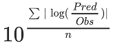

The following section shows the correlations between observed and model-predicted AUClast and Cmax ratios, respectively.

Specifically, the PBPK model performance for the PK parameters **AUC ratio (AUCR)** and **Cmax ratio (CmaxR)** is assessed via:

- predicted (*Pred*) vs. observed (*Obs*) plots

- *Pred*/*Obs* vs. *Obs* plots

- geometric mean fold error (GMFE):
  
  
  
- number of AUCR and CMAXR falling within 2-fold error range and within the limits suggested by [Guest et al. 2011](#references)
  
- detailed table of results for each study

In the plots,

- the dotted lines denote 0.50–2.00 (2-fold) criterion,

- the solid lines denote the limits suggested by [Guest et al. 2011](#references),

- the bold solid line denotes the unity line,

- each color represents one combination of perpetrator and victim (parent drug or metabolite)

***
